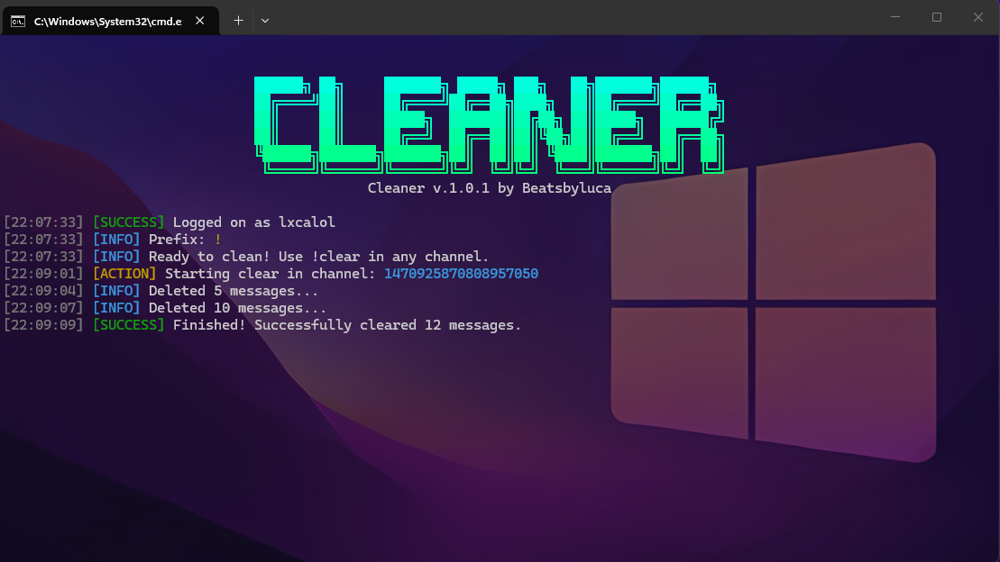

# 🧹 Cleaner v.1.0.1

> **Fast, Sleek & Automated Discord self-bot message removal**



---

## ✨ Features

- 🧹 **Deep Clean**: Deletes all your own messages in any channel or DM with `!clear`.
- ⚡ **Optimized Performance**: Small async delays to process deletions safely and quickly.
- 🎨 **Premium UI**: Beautiful Cyan-to-Green gradient logs powered by `pystyle`.
- 🛠️ **Configurable**: Easily change your prefix and token via `config.json`.
- 📡 **Built-in Utilities**: Includes `!ping` for latency and `!say` for repetition.
- 🔐 **Privacy Focused**: Only deletes messages sent by your account.

---

## 🚀 Quick Start

### 1. Requirements
Ensure you have Python 3.10+ installed, then install the dependencies:
```bash
pip install -r requirements.txt
```

### 2. Configuration
Edit the `config.json` file in the root directory:
```json
{
  "token": "YOUR_USER_TOKEN_HERE",
  "command_prefix": "!"
}
```

### 3. Run
Start the cleaner:
```bash
python main.py
```

---

## 📖 Commands

| Command | Description |
| :--- | :--- |
| `!clear` | Removes **all** your messages from the current channel history. |
| `!ping` | Returns the current bot latency. |
| `!say <text>` | Makes the bot repeat your input. |

---

## ⚠️ Disclaimer
**This tool is for educational purposes only.**
- Automating user accounts (**self-bots**) is against **Discord's Terms of Service**.
- Use this at your own risk. The author is not responsible for any account terminations.

---

## 🛠️ Built With

* [discord.py-self](https://github.com/dolfies/discord.py-self) - User Account API
* [Pystyle](https://github.com/billythegoat356/pystyle) - Visual Aesthetics
* [Colorama](https://github.com/tartley/colorama) - Terminal Colors

---

**Created with ❤️ by Beatsbyluca**
